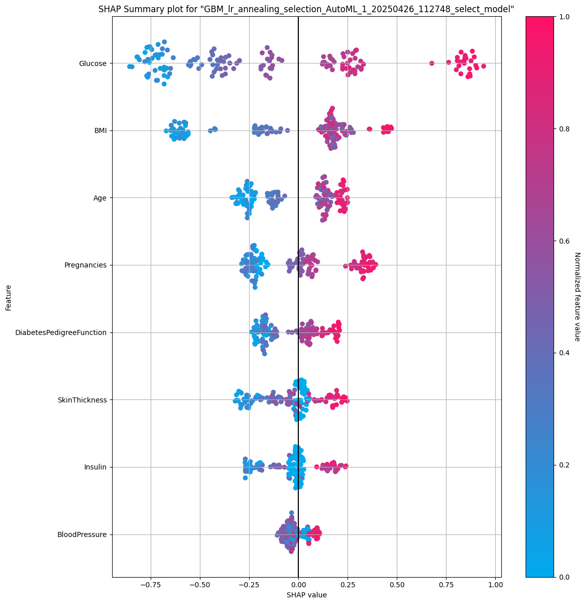

# End-to-End Diabetes Prediction: H2O AutoML & MLflow MLOps (AUC 0.85)

This project implements a robust machine learning pipeline to predict diabetes onset using the Pima Indians Diabetes Database. I leveraged H2O.ai's AutoML for efficient model development and integrated key MLOps principles using MLflow, Docker, and other tools to ensure reproducibility, traceability, and deployment readiness. The primary goal was to not only build an accurate model but also to understand its drivers and manage its lifecycle effectively.

## Key Features & Accomplishments

*   **Automated EDA & Validation:** Conducted thorough Exploratory Data Analysis using `ydata-profiling` (identifying potential data quality issues like zero values in Glucose/BloodPressure - see analysis below) and enforced data integrity via `Pandera` schema validation.
    *   *EDA Snippet Example:*
         <!-- Replace with path to your image -->
*   **High-Performance Modeling:** Utilized H2O AutoML to train multiple models, achieving a top-performing **GBM with AUC ≈ 0.854** and **Accuracy ≈ 77.4%** on the test set.
*   **In-Depth Interpretation:** Employed **SHAP analysis** to interpret the GBM model, identifying **Glucose, BMI, and Age** as the most impactful predictors.
    *   *SHAP Summary Plot:*
         
*   **End-to-End MLOps Workflow:**
    *   **Configuration Management:** Centralized all settings in `config.yaml`.
    *   **Experiment Tracking:** Logged parameters, metrics, code context, and all artifacts for each run using **MLflow**.
        *   *MLflow Experiments View:*
             
    *   **Model Registry & Lifecycle:** Programmatically registered the best model using `mlflow.h2o.log_model` and managed its status with **Tags** (e.g., `validation_status: passed`) and **Aliases** (e.g., `@production`) via the MLflow UI, adhering to current best practices.
    *   **Reproducibility:** Ensured environment consistency and deployment readiness using **Docker**.
    *   **Code Quality:** Implemented unit tests using **pytest**.
    *   **Version Control:** Structured the project for `Git` with a proper `.gitignore`.
*   **Deployment Foundation:** Developed a basic **Flask API** (`app.py`) to serve predictions from the saved MOJO model.
*   **Actionable Insights:** Derived practical recommendations based on model performance and interpretability.

## Project Structure

H2O_Diabetes_Project/
├── models/ # Saved local models (binary, MOJO)
├── reports/ # Generated reports (EDA, plots, results CSVs)
├── tests/ # Unit tests
├── images/ # Optional: For embedded images in README
├── .venv/ # Python virtual environment (ignored)
├── mlruns/ # MLflow tracking data (ignored)
├── .gitignore # Git ignore file
├── app.py # Flask API script
├── config.yaml # Project configuration
├── diabetes.csv # Dataset
├── Dockerfile # Docker container definition
├── predict_diabetes.py # Main training & MLOps script
├── README.md # This documentation file
├── requirements.txt # Python dependencies
└── utils.py # Utility functions


## Prerequisites

*   Python (3.9 - 3.11 recommended)
*   Java JDK (11 or 17)
*   Docker Desktop (or Engine)
*   Git

## Setup and Installation


1.  **Dataset:** Download `diabetes.csv` (e.g., from [Kaggle](https://www.kaggle.com/datasets/uciml/pima-indians-diabetes-database)) into the root directory.
2.  **Environment:**
    ```powershell
    # Windows PowerShell
    python -m venv .venv
    .\.venv\Scripts\Activate.ps1
    ```
3.  **Dependencies:** `pip install -r requirements.txt`
4.  **Java Check:** Ensure `java -version` works and shows JDK 11/17.

## Running the Project

**Option 1: Local Execution**

1.  **Activate Env:** `.\.venv\Scripts\Activate.ps1`
2.  **Train & Evaluate:** `python predict_diabetes.py` (Generates models/ & reports/)
3.  **View MLflow UI:** `mlflow ui` (Access http://localhost:5000)
4.  **(Optional) Run API:** `python app.py` (Access http://localhost:5000)
5.  **(Optional) Run Tests:** `pytest`

**Option 2: Docker Execution**

1.  **Build Image:** `docker build -t h2o-diabetes-app .`
2.  **Train & Evaluate Container:**
    ```bash
    # Mount volumes to persist outputs on host
    docker run --rm --name h2o_train_run -v "$(pwd)/mlruns:/app/mlruns" -v "$(pwd)/models:/app/models" -v "$(pwd)/reports:/app/reports" h2o-diabetes-app
    ```
3.  **View MLflow UI:** Run `mlflow ui` on your *host machine*.
4.  **(Optional) Run API Container:**
    ```bash
    docker run --rm --name h2o_api_run -p 5000:5000 -v "$(pwd)/models:/app/models" -v "$(pwd)/config.yaml:/app/config.yaml" h2o-diabetes-app python app.py
    ```
    (Access API at http://localhost:5000 from host)

## Results & Analysis

*   **Model Performance:** The best GBM model achieved **AUC ≈ 0.854** and **Accuracy ≈ 77.4%** on the test set. Key metrics:
    *   Sensitivity (Recall): **≈ 86.3%** (Good at identifying actual diabetics)
    *   Specificity: **≈ 73.1%**
    *   Precision: **≈ 61.1%** (Indicates potential for false positives)
    *   F1-Score: **≈ 0.715**
    *   False Negative Rate: **≈ 13.7%** (Model misses about 14% of actual cases)
*   **EDA Insights:** The automated EDA (`reports/diabetes_data_profile.html`) highlighted potentially unrealistic zero values in `Glucose` (0.7%) and `BloodPressure` (4.6%), suggesting potential data quality issues or specific patient conditions needing consideration. Correlations (`reports/correlations.png` - see below) showed expected relationships like Age/Pregnancies and BMI/SkinThickness. Interaction plots (e.g., Insulin vs BloodPressure) were explored but didn't reveal strong immediate patterns for this analysis.
    *   *Correlation Heatmap:*
         
*   **Model Interpretation (SHAP):** The SHAP analysis (`reports/shap_summary_plot.png`) confirmed **Glucose** as the most dominant predictor, followed by **BMI** and **Age**. Higher values in these features strongly increase the model's prediction towards diabetes. Other features contributed but had less overall impact magnitude.
*   **Actionable Recommendations:**
    1.  **Deployment:** Use the model for **risk stratification** due to high sensitivity, flagging patients for confirmatory clinical tests rather than direct diagnosis (mitigates lower precision).
    2.  **Intervention:** Focus patient advice and interventions on managing **Glucose levels, BMI (weight management), and age-related check-ups**, as these factors most significantly drive the model's risk prediction.
    3.  **Improvement:** Future work could focus on reducing the False Negative Rate (13.7%) and improving Precision, potentially through feature engineering or alternative modeling techniques.

## MLOps Workflow Integration

This project demonstrates key MLOps practices:

*   **Traceability:** `MLflow` tracks every run, linking parameters, metrics, code context (via git commit implicitly), and artifacts.
*   **Reproducibility:** `Docker` and `requirements.txt` ensure the environment can be reliably recreated.
*   **Model Management:** The `MLflow Model Registry` with Tags and Aliases provides a structured way to version, validate, and manage models for deployment.
*   **Automation:** Configuration files and scripts streamline the training and evaluation process.
*   **Quality:** `Pandera` validation and `pytest` unit tests enhance reliability.

## Future Work

*   Explore feature engineering techniques to improve model performance (especially reducing FNR).
*   Investigate different algorithms or hyperparameter tuning beyond the AutoML baseline.
*   Develop a more robust API deployment strategy using the MLflow Model Registry URI directly.
*   Implement data drift monitoring for the deployed model.

---